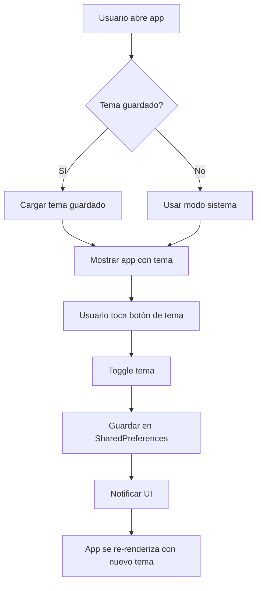

# 🌓 Modo Oscuro - Documentación

> **Última actualización:** 7 de noviembre de 2025  
> **Versión:** 1.0.0

## 📑 Índice

1. [Descripción General](#descripción-general)
2. [Implementación Técnica](#implementación-técnica)
3. [Componentes Creados](#componentes-creados)
4. [Uso en la Aplicación](#uso-en-la-aplicación)
5. [Personalización](#personalización)
6. [Testing](#testing)

---

## 🎯 Descripción General

La funcionalidad de **modo oscuro** permite a los usuarios alternar entre tres modos de visualización:

- 🌞 **Modo Claro** - Tema claro con fondo blanco y textos oscuros
- 🌙 **Modo Oscuro** - Tema oscuro con fondo oscuro y textos claros
- 🔄 **Automático (Sistema)** - Respeta la configuración del sistema operativo

### Características Implementadas

✅ Cambio dinámico de tema sin reiniciar la app  
✅ Persistencia del tema seleccionado (SharedPreferences)  
✅ Botón de toggle en AppBar de páginas principales  
✅ Widgets reutilizables para selector de tema  
✅ Animación suave al cambiar de tema  
✅ Respeta Material Design 3  

---

## 🏗️ Implementación Técnica

### Arquitectura

```
lib/
├── shared/
│   ├── providers/
│   │   └── theme_provider.dart          # Gestión de estado del tema
│   └── widgets/
│       └── theme_selector.dart          # Widgets de selección de tema
├── config/
│   └── themes/
│       ├── app_theme.dart               # Temas claro y oscuro
│       └── theme_extensions.dart        # Extensiones de tema
└── main.dart                            # Integración del ThemeProvider
```

---

### 1. ThemeProvider

**Ubicación:** `lib/shared/providers/theme_provider.dart`

**Propósito:** Gestionar el estado del tema y su persistencia.

```dart
class ThemeProvider extends ChangeNotifier {
  ThemeMode _themeMode = ThemeMode.system;
  
  ThemeMode get themeMode => _themeMode;
  
  bool get isDarkMode {
    if (_themeMode == ThemeMode.dark) return true;
    if (_themeMode == ThemeMode.light) return false;
    return false; // Default para system
  }
  
  Future<void> setThemeMode(ThemeMode mode) async {
    if (_themeMode == mode) return;
    
    _themeMode = mode;
    notifyListeners();
    
    // Guardar en SharedPreferences
    final prefs = await SharedPreferences.getInstance();
    await prefs.setInt('theme_mode', mode.index);
  }
  
  Future<void> toggleTheme() async {
    if (_themeMode == ThemeMode.dark) {
      await setThemeMode(ThemeMode.light);
    } else {
      await setThemeMode(ThemeMode.dark);
    }
  }
}
```

**Métodos Principales:**

| Método | Descripción |
|--------|-------------|
| `setThemeMode(ThemeMode)` | Cambia el tema a claro, oscuro o sistema |
| `toggleTheme()` | Alterna entre modo claro y oscuro |
| `setLightMode()` | Cambia a modo claro |
| `setDarkMode()` | Cambia a modo oscuro |
| `setSystemMode()` | Usa el tema del sistema |

**Propiedades:**

| Propiedad | Tipo | Descripción |
|-----------|------|-------------|
| `themeMode` | `ThemeMode` | Modo de tema actual |
| `isDarkMode` | `bool` | Si está en modo oscuro |
| `themeName` | `String` | Nombre legible del tema |
| `themeIcon` | `IconData` | Ícono del tema actual |

---

### 2. Integración en main.dart

**Antes:**
```dart
MaterialApp.router(
  theme: AppTheme.lightTheme,
  routerConfig: AppRoutes.router,
);
```

**Después:**
```dart
MultiProvider(
  providers: [
    ChangeNotifierProvider<ThemeProvider>(
      create: (context) => ThemeProvider(),
    ),
    // ... otros providers
  ],
  child: Consumer2<AuthProvider, ThemeProvider>(
    builder: (context, authProvider, themeProvider, child) {
      return MaterialApp.router(
        theme: AppTheme.lightTheme,
        darkTheme: AppTheme.darkTheme,
        themeMode: themeProvider.themeMode,
        routerConfig: AppRoutes.router,
      );
    },
  ),
);
```

**Cambios realizados:**
1. ✅ Agregado `ThemeProvider` a MultiProvider
2. ✅ Cambiado `Consumer<AuthProvider>` a `Consumer2<AuthProvider, ThemeProvider>`
3. ✅ Agregado `darkTheme: AppTheme.darkTheme`
4. ✅ Agregado `themeMode: themeProvider.themeMode`

---

### 3. Tema Oscuro (app_theme.dart)

El tema oscuro ya estaba definido en `app_theme.dart`:

```dart
class AppTheme {
  static ThemeData get lightTheme { /* ... */ }
  
  static ThemeData get darkTheme => ThemeExtensions.darkTheme;
}
```

**Paleta de Colores del Tema Oscuro:**

```dart
ColorScheme.dark(
  primary: ColorConstants.primaryColor,      // Rojo principal
  onPrimary: ColorConstants.textOnPrimaryColor,
  surface: Color(0xFF121212),                // Fondo oscuro
  onSurface: Colors.white,                   // Texto claro
  // ... más colores
)
```

---

## 🧩 Componentes Creados

### 1. ThemeToggleButton

**Uso:** Botón simple para alternar entre modo claro y oscuro.

```dart
// En AppBar
Consumer<ThemeProvider>(
  builder: (context, themeProvider, _) {
    return IconButton(
      icon: Icon(themeProvider.themeIcon),
      onPressed: () => themeProvider.toggleTheme(),
      tooltip: themeProvider.themeName,
    );
  },
),
```

**Implementado en:**
- ✅ `home_page.dart` - AppBar
- ✅ `admin_users_page.dart` - AppBar

---

### 2. ThemeSelector

**Uso:** Widget con opciones de radio para seleccionar tema.

```dart
import 'package:stock_letu_shops/shared/widgets/theme_selector.dart';

// Mostrar selector
ThemeSelector()
```

**Características:**
- ☀️ Opción Modo Claro
- 🌙 Opción Modo Oscuro
- 🔄 Opción Automático (Sistema)

---

### 3. ThemeDialog

**Uso:** Diálogo completo para cambiar el tema.

```dart
import 'package:stock_letu_shops/shared/widgets/theme_selector.dart';

// Mostrar diálogo
ThemeDialog.show(context);
```

**Ejemplo de integración en menú de configuración:**

```dart
ListTile(
  leading: Icon(Icons.palette),
  title: Text('Apariencia'),
  onTap: () => ThemeDialog.show(context),
),
```

---

### 4. ThemeSwitch

**Uso:** Switch simple para alternar modo oscuro.

```dart
import 'package:stock_letu_shops/shared/widgets/theme_selector.dart';

ThemeSwitch(label: 'Modo Oscuro')
```

**Características:**
- ON = Modo Oscuro
- OFF = Modo Claro
- Incluye ícono animado

---

### 5. ThemeSettingsTile

**Uso:** ListTile para página de configuración.

```dart
import 'package:stock_letu_shops/shared/widgets/theme_selector.dart';

ThemeSettingsTile()
```

**Características:**
- Muestra tema actual como subtítulo
- Al tocar, abre `ThemeDialog`
- Incluye ícono del tema actual

---

## 🚀 Uso en la Aplicación

### Cambiar Tema desde AppBar

**Implementado en `home_page.dart` y `admin_users_page.dart`:**

```dart
appBar: AppBar(
  title: Text('Inicio'),
  actions: [
    // Botón de tema
    Consumer<ThemeProvider>(
      builder: (context, themeProvider, _) {
        return IconButton(
          icon: Icon(themeProvider.themeIcon),
          onPressed: () => themeProvider.toggleTheme(),
          tooltip: themeProvider.themeName,
        );
      },
    ),
    // ... otros botones
  ],
),
```

**Resultado:**
- Clic en el botón alterna entre ☀️ modo claro y 🌙 modo oscuro
- El ícono cambia automáticamente
- El tooltip muestra el modo actual

---

### Agregar Selector en Configuración (Ejemplo)

**Crear página de configuración:**

```dart
class SettingsPage extends StatelessWidget {
  @override
  Widget build(BuildContext context) {
    return Scaffold(
      appBar: AppBar(title: Text('Configuración')),
      body: ListView(
        children: [
          // Categoría: Apariencia
          ListTile(
            title: Text(
              'APARIENCIA',
              style: TextStyle(
                fontWeight: FontWeight.bold,
                color: Colors.grey,
              ),
            ),
          ),
          
          // Opción de tema con diálogo
          ThemeSettingsTile(),
          
          Divider(),
          
          // O usar switch
          ThemeSwitch(label: 'Modo Oscuro'),
          
          // ... más configuraciones
        ],
      ),
    );
  }
}
```

---

### Acceso Programático al Tema

**Leer tema actual:**

```dart
final themeProvider = context.watch<ThemeProvider>();
final isDark = themeProvider.isDarkMode;

if (isDark) {
  // Hacer algo en modo oscuro
}
```

**Cambiar tema programáticamente:**

```dart
// Cambiar a modo oscuro
context.read<ThemeProvider>().setDarkMode();

// Cambiar a modo claro
context.read<ThemeProvider>().setLightMode();

// Usar tema del sistema
context.read<ThemeProvider>().setSystemMode();

// Toggle simple
context.read<ThemeProvider>().toggleTheme();
```

---

## 🎨 Personalización

### Modificar Tema Oscuro

**Ubicación:** `lib/config/themes/theme_extensions.dart`

```dart
static ThemeData get darkTheme {
  return ThemeData(
    useMaterial3: true,
    brightness: Brightness.dark,
    
    colorScheme: ColorScheme.dark(
      primary: Color(0xFFFF5252), // Cambiar rojo principal
      surface: Color(0xFF1E1E1E),  // Cambiar fondo
      // ... más colores
    ),
    
    // ... personalizar componentes
  );
}
```

---

### Agregar Colores Personalizados

**Crear extension para colores dinámicos:**

```dart
extension ThemeColors on BuildContext {
  Color get cardBackground {
    return Theme.of(this).brightness == Brightness.dark
        ? Color(0xFF2C2C2C)
        : Colors.white;
  }
  
  Color get textPrimary {
    return Theme.of(this).brightness == Brightness.dark
        ? Colors.white
        : Colors.black87;
  }
}
```

**Uso:**

```dart
Container(
  color: context.cardBackground,
  child: Text(
    'Hola',
    style: TextStyle(color: context.textPrimary),
  ),
)
```

---

### Agregar Más Opciones de Tema

**Ejemplo: Tema AMOLED (Negro puro)**

```dart
// En ThemeProvider
Future<void> setAmoledMode() async {
  // Implementar lógica para tema AMOLED
  _themeMode = ThemeMode.dark; // Usar modo oscuro base
  _isAmoled = true;
  notifyListeners();
}

// En app_theme.dart
static ThemeData get amoledTheme {
  return ThemeData.dark().copyWith(
    scaffoldBackgroundColor: Colors.black,
    // ... configuración AMOLED
  );
}
```

---

## 🧪 Testing

### Test del ThemeProvider

```dart
import 'package:flutter_test/flutter_test.dart';
import 'package:stock_letu_shops/shared/providers/theme_provider.dart';

void main() {
  group('ThemeProvider Tests', () {
    test('Inicializa con modo sistema', () {
      final provider = ThemeProvider();
      expect(provider.themeMode, ThemeMode.system);
    });
    
    test('Cambia a modo oscuro', () async {
      final provider = ThemeProvider();
      await provider.setDarkMode();
      expect(provider.themeMode, ThemeMode.dark);
      expect(provider.isDarkMode, true);
    });
    
    test('Toggle alterna entre claro y oscuro', () async {
      final provider = ThemeProvider();
      await provider.setLightMode();
      
      await provider.toggleTheme();
      expect(provider.themeMode, ThemeMode.dark);
      
      await provider.toggleTheme();
      expect(provider.themeMode, ThemeMode.light);
    });
  });
}
```

---

### Test de UI con Tema

```dart
testWidgets('HomePage muestra botón de tema', (tester) async {
  await tester.pumpWidget(
    MultiProvider(
      providers: [
        ChangeNotifierProvider(create: (_) => ThemeProvider()),
      ],
      child: MaterialApp(home: HomePage()),
    ),
  );
  
  // Verificar que existe el botón de tema
  expect(find.byIcon(Icons.light_mode), findsOneWidget);
  
  // Tap en el botón
  await tester.tap(find.byIcon(Icons.light_mode));
  await tester.pumpAndSettle();
  
  // Verificar que cambió a oscuro
  expect(find.byIcon(Icons.dark_mode), findsOneWidget);
});
```

---

## 📱 Screenshots

### Modo Claro vs Modo Oscuro

| Pantalla | Modo Claro | Modo Oscuro |
|----------|------------|-------------|
| **Home** | Fondo blanco, texto negro | Fondo oscuro (#121212), texto blanco |
| **Admin Users** | Cards blancos | Cards oscuros (#2C2C2C) |
| **Login** | Fondo blanco | Fondo oscuro |

---

## 🔄 Flujo de Usuario



---

## 📋 Checklist de Implementación

- [x] Crear `ThemeProvider` con persistencia
- [x] Integrar `ThemeProvider` en `main.dart`
- [x] Configurar `darkTheme` en MaterialApp
- [x] Agregar botón de toggle en `home_page.dart`
- [x] Agregar botón de toggle en `admin_users_page.dart`
- [x] Crear widgets reutilizables (`ThemeSelector`, etc.)
- [x] Documentación completa
- [ ] Tests unitarios del provider
- [ ] Tests de integración de UI
- [ ] Screenshots de ejemplo

---

## 🚨 Problemas Comunes

### 1. Tema no persiste al reiniciar

**Causa:** SharedPreferences no está instalado o no se inicializa.

**Solución:**
```yaml
# pubspec.yaml
dependencies:
  shared_preferences: ^2.3.2
```

```bash
flutter pub get
```

---

### 2. Tema no cambia inmediatamente

**Causa:** No se está usando `Consumer` o `watch`.

**Solución:**
```dart
// ❌ Incorrecto
context.read<ThemeProvider>().themeMode

// ✅ Correcto
Consumer<ThemeProvider>(
  builder: (context, themeProvider, _) {
    return IconButton(/* ... */);
  },
)
```

---

### 3. AppBar no cambia de color en modo oscuro

**Causa:** Estás usando colores hardcodeados.

**Solución:**
```dart
// ❌ Incorrecto
AppBar(
  backgroundColor: Color(0xFFD32F2F),
)

// ✅ Correcto
AppBar(
  backgroundColor: Theme.of(context).primaryColor,
)
```

---

## 🔮 Próximas Mejoras

### Corto Plazo
- [ ] Agregar animación al cambiar tema
- [ ] Detectar tema del sistema automáticamente
- [ ] Página de configuración completa con ThemeSettingsTile

### Mediano Plazo
- [ ] Tema AMOLED (negro puro para pantallas OLED)
- [ ] Temas personalizados (colores configurables)
- [ ] Modo "lectura nocturna" con filtro naranja

### Largo Plazo
- [ ] Múltiples paletas de colores
- [ ] Tema por horario (auto día/noche)
- [ ] Sincronización de tema entre dispositivos

---

## 📞 Soporte

Para dudas sobre el modo oscuro:
- 📧 Email: desarrollo@letushops.com
- 📝 Issues: [GitHub Issues](https://github.com/galva-developer/app-stock-store-letushops/issues)

---

**© 2025 Letu Shops - Stock Management System**
