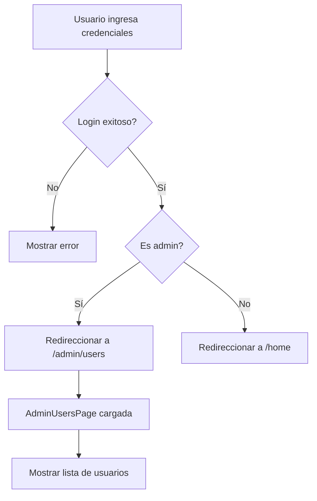
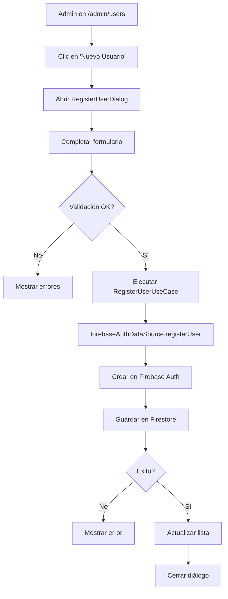
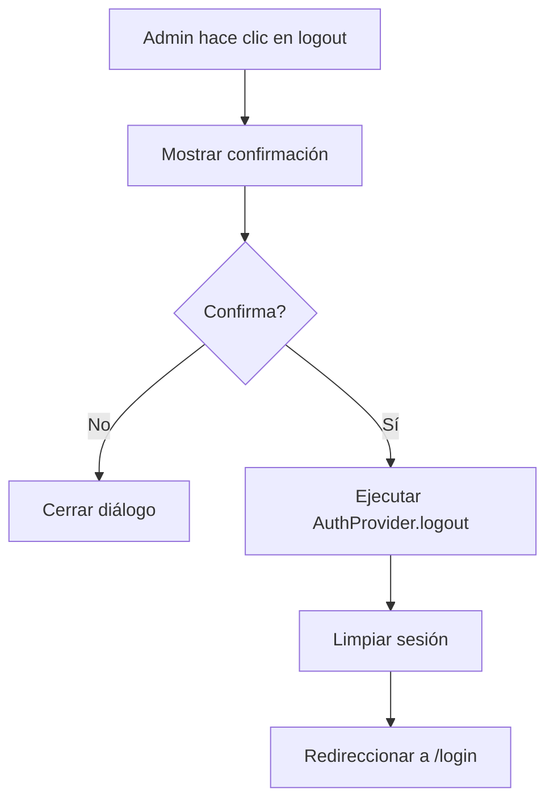

# 📋 Documentación del Rol Administrador

> **Última actualización:** 7 de noviembre de 2025  
> **Versión:** 1.0.0

## 📑 Índice

1. [Descripción General](#descripción-general)
2. [Estructura de Archivos](#estructura-de-archivos)
3. [Funcionalidades del Administrador](#funcionalidades-del-administrador)
4. [Flujo de Navegación](#flujo-de-navegación)
5. [Permisos y Seguridad](#permisos-y-seguridad)
6. [Casos de Uso](#casos-de-uso)
7. [Componentes Clave](#componentes-clave)

---

## 🎯 Descripción General

El **rol Administrador** (`UserRole.admin`) tiene privilegios completos en la aplicación Stock Letu Shops. Es el único rol autorizado para:

- ✅ Crear nuevos usuarios
- ✅ Gestionar usuarios existentes
- ✅ Acceder al panel de administración
- ✅ Configurar permisos en Firestore
- ✅ Navegar libremente por la aplicación

### Características del Rol

| Característica | Valor |
|---------------|-------|
| **Nombre del Rol** | `admin` |
| **Nivel de Acceso** | Completo |
| **Ruta Principal** | `/admin/users` |
| **Puede crear usuarios** | ✅ Sí |
| **Acceso a Home** | ✅ Sí (opcional) |
| **Acceso a Inventario** | ✅ Sí |
| **Acceso a Reportes** | ✅ Sí |

---

## 📂 Estructura de Archivos

### 1. **Capa de Dominio (Domain Layer)**

```
lib/features/authentication/domain/
├── entities/
│   └── auth_user.dart                    # Entidad AuthUser con propiedad isAdmin
├── repositories/
│   └── auth_repository.dart              # Interfaz con registerUser()
└── usecases/
    └── admin/
        └── register_user_usecase.dart    # Caso de uso para registro de usuarios
```

#### `auth_user.dart`
**Propósito:** Define la entidad del usuario autenticado.

```dart
class AuthUser {
  final String id;
  final String email;
  final String? displayName;
  final UserRole role;
  
  bool get isAdmin => role == UserRole.admin;  // ✨ Identificador de admin
  bool get isManager => role == UserRole.manager;
  bool get isEmployee => role == UserRole.employee;
}
```

**Responsabilidades:**
- Representa un usuario en el dominio de la aplicación
- Provee getters para identificar roles (`isAdmin`, `isManager`, `isEmployee`)
- Es inmutable y no depende de Firebase

---

#### `auth_repository.dart`
**Propósito:** Contrato del repositorio de autenticación.

```dart
abstract class AuthRepository {
  // ... otros métodos
  
  Future<Either<AuthFailure, AuthUser>> registerUser({
    required String email,
    required String password,
    required String displayName,
    required UserRole role,
  });
}
```

**Responsabilidades:**
- Define el método `registerUser()` para crear usuarios
- Solo accesible para administradores (verificado en capa de presentación)

---

#### `register_user_usecase.dart`
**Propósito:** Implementa la lógica de negocio para registro de usuarios.

```dart
class RegisterUserUseCase {
  final AuthRepository repository;
  
  Future<Either<AuthFailure, AuthUser>> call({
    required String email,
    required String password,
    required String displayName,
    required UserRole role,
  }) async {
    // Validaciones de negocio
    if (email.isEmpty || password.isEmpty || displayName.isEmpty) {
      return Left(AuthFailure.invalidCredentials(/* ... */));
    }
    
    return await repository.registerUser(
      email: email,
      password: password,
      displayName: displayName,
      role: role,
    );
  }
}
```

**Responsabilidades:**
- Valida datos de entrada antes de crear usuario
- Delega la creación al repositorio
- Retorna `Either<AuthFailure, AuthUser>` para manejo de errores funcional

---

### 2. **Capa de Datos (Data Layer)**

```
lib/features/authentication/data/
├── datasources/
│   └── firebase_auth_datasource.dart     # Implementación Firebase
├── repositories/
│   └── auth_repository_impl.dart         # Implementación del repositorio
└── models/
    └── user_model.dart                   # Modelo de datos del usuario
```

#### `firebase_auth_datasource.dart`
**Propósito:** Interactúa directamente con Firebase Auth y Firestore.

```dart
class FirebaseAuthDataSource {
  final FirebaseAuth _firebaseAuth;
  final FirebaseFirestore _firestore;
  
  Future<UserModel> registerUser({
    required String email,
    required String password,
    required String displayName,
    required UserRole role,
  }) async {
    // 1. Crear usuario en Firebase Auth
    final userCredential = await _firebaseAuth.createUserWithEmailAndPassword(
      email: email,
      password: password,
    );
    
    // 2. Actualizar displayName
    await userCredential.user!.updateDisplayName(displayName);
    
    // 3. Crear documento en Firestore con rol
    await _firestore.collection('users').doc(userCredential.user!.uid).set({
      'email': email,
      'displayName': displayName,
      'role': role.toString().split('.').last,
      'createdAt': FieldValue.serverTimestamp(),
    });
    
    return UserModel(/* ... */);
  }
}
```

**Responsabilidades:**
- Crea usuario en Firebase Authentication
- Almacena información del usuario en Firestore
- Asigna el rol especificado
- Maneja errores de Firebase

---

#### `auth_repository_impl.dart`
**Propósito:** Implementa `AuthRepository` usando `FirebaseAuthDataSource`.

```dart
class AuthRepositoryImpl implements AuthRepository {
  final FirebaseAuthDataSource dataSource;
  
  @override
  Future<Either<AuthFailure, AuthUser>> registerUser({
    required String email,
    required String password,
    required String displayName,
    required UserRole role,
  }) async {
    try {
      final userModel = await dataSource.registerUser(
        email: email,
        password: password,
        displayName: displayName,
        role: role,
      );
      return Right(userModel.toEntity());
    } catch (e) {
      return Left(AuthFailure.fromException(e));
    }
  }
}
```

**Responsabilidades:**
- Convierte excepciones en `AuthFailure`
- Transforma `UserModel` a `AuthUser` (entidad de dominio)
- Implementa patrón Either para manejo de errores

---

### 3. **Capa de Presentación (Presentation Layer)**

```
lib/features/authentication/presentation/
├── pages/
│   ├── login_page.dart                   # Redirección según rol
│   └── admin/
│       └── admin_users_page.dart         # Panel de administración
├── widgets/
│   └── admin/
│       └── register_user_dialog.dart     # Diálogo de registro
└── providers/
    └── admin_users_provider.dart         # Estado de usuarios admin
```

#### `login_page.dart`
**Propósito:** Maneja el login y redirección según rol.

```dart
Future<void> _handleLogin() async {
  final success = await authProvider.login(email, password);
  
  if (success && mounted) {
    final currentUser = authProvider.currentUser;
    
    if (currentUser != null && currentUser.isAdmin) {
      context.go('/admin/users');  // ✨ Admin → Panel de administración
    } else {
      context.go('/home');         // Otros → Home
    }
  }
}
```

**Flujo de Redirección:**
1. Usuario ingresa credenciales
2. `AuthProvider` valida y obtiene datos del usuario
3. Si `isAdmin == true` → `/admin/users`
4. Si no → `/home`

---

#### `admin_users_page.dart`
**Propósito:** Página principal del panel de administración.

```dart
class AdminUsersPage extends StatefulWidget {
  @override
  Widget build(BuildContext context) {
    return Scaffold(
      appBar: AppBar(title: Text('Gestión de Usuarios')),
      body: Consumer<AdminUsersProvider>(
        builder: (context, provider, _) {
          return ListView.builder(
            itemCount: provider.users.length,
            itemBuilder: (context, index) {
              final user = provider.users[index];
              return UserListTile(user: user);
            },
          );
        },
      ),
      floatingActionButton: FloatingActionButton.extended(
        onPressed: () => _showRegisterDialog(context),
        icon: Icon(Icons.person_add),
        label: Text('Nuevo Usuario'),
      ),
    );
  }
  
  void _showRegisterDialog(BuildContext context) {
    showDialog(
      context: context,
      builder: (_) => RegisterUserDialog(
        onRegister: (email, password, displayName, role) {
          context.read<AdminUsersProvider>().registerUser(
            email: email,
            password: password,
            displayName: displayName,
            role: role,
          );
        },
      ),
    );
  }
}
```

**Responsabilidades:**
- Muestra lista de usuarios registrados
- Provee botón para crear nuevos usuarios
- Delega registro a `AdminUsersProvider`

---

#### `register_user_dialog.dart`
**Propósito:** Formulario modal para crear usuarios.

```dart
class RegisterUserDialog extends StatefulWidget {
  final Function(String email, String password, String displayName, UserRole role) onRegister;
  
  @override
  Widget build(BuildContext context) {
    return AlertDialog(
      title: Text('Registrar Nuevo Usuario'),
      content: Form(
        key: _formKey,
        child: Column(
          children: [
            TextFormField(/* Email */),
            TextFormField(/* Contraseña */),
            TextFormField(/* Nombre */),
            DropdownButtonFormField<UserRole>(/* Rol */),
          ],
        ),
      ),
      actions: [
        TextButton(onPressed: _cancel, child: Text('Cancelar')),
        ElevatedButton(onPressed: _submit, child: Text('Registrar')),
      ],
    );
  }
}
```

**Validaciones:**
- ✅ Email válido
- ✅ Contraseña mínimo 6 caracteres
- ✅ Nombre no vacío
- ✅ Rol seleccionado

---

#### `admin_users_provider.dart`
**Propósito:** Maneja el estado de la gestión de usuarios.

```dart
class AdminUsersProvider extends ChangeNotifier {
  final RegisterUserUseCase _registerUserUseCase;
  
  List<AuthUser> _users = [];
  bool _isLoading = false;
  String? _errorMessage;
  
  Future<void> registerUser({
    required String email,
    required String password,
    required String displayName,
    required UserRole role,
  }) async {
    _isLoading = true;
    _errorMessage = null;
    notifyListeners();
    
    final result = await _registerUserUseCase.call(
      email: email,
      password: password,
      displayName: displayName,
      role: role,
    );
    
    result.fold(
      (failure) {
        _errorMessage = failure.userMessage;
      },
      (user) {
        _users.add(user);
      },
    );
    
    _isLoading = false;
    notifyListeners();
  }
}
```

**Responsabilidades:**
- Ejecuta `RegisterUserUseCase`
- Maneja estados de carga y error
- Notifica cambios a la UI

---

### 4. **Configuración y Rutas**

```
lib/config/routes/
├── app_router.dart                       # Definición de rutas
└── route_guard.dart                      # Protección de rutas
```

#### `app_router.dart`
**Propósito:** Define todas las rutas de la aplicación.

```dart
final appRouter = GoRouter(
  routes: [
    GoRoute(
      path: '/admin/users',
      name: 'admin-users',
      builder: (context, state) => const AdminUsersPage(),
    ),
    // ... otras rutas
  ],
  redirect: RouteGuard.guard,
);
```

---

#### `route_guard.dart`
**Propósito:** Protege rutas según autenticación.

```dart
class RouteGuard {
  static final _protectedRoutes = [
    '/home',
    '/admin',          // ✨ Protegida
    '/admin/users',    // ✨ Protegida
    '/inventory',
    '/reports',
  ];
  
  static String? guard(BuildContext context, GoRouterState state) {
    final authProvider = context.read<AuthProvider>();
    final isAuthenticated = authProvider.isAuthenticated;
    
    if (!isAuthenticated && isProtectedRoute(state.matchedLocation)) {
      return '/login';
    }
    
    return null;
  }
}
```

**Comportamiento Actual:**
- ✅ Admin puede acceder a `/admin/users` (ruta principal)
- ✅ Admin puede acceder a `/home` (acceso flexible)
- ✅ Managers/Empleados no pueden acceder a `/admin/*`

---

## 🚀 Funcionalidades del Administrador

### 1. **Crear Usuarios**

**Ubicación:** `/admin/users` → Botón "Nuevo Usuario"

**Proceso:**
1. Admin hace clic en FloatingActionButton
2. Se abre `RegisterUserDialog`
3. Admin completa formulario:
   - Email
   - Contraseña (min. 6 caracteres)
   - Nombre completo
   - Rol (Admin/Manager/Employee)
4. Se ejecuta `RegisterUserUseCase`
5. Firebase crea el usuario
6. Firestore almacena datos + rol
7. Lista de usuarios se actualiza

**Código de Ejecución:**
```dart
await context.read<AdminUsersProvider>().registerUser(
  email: 'nuevo@ejemplo.com',
  password: 'password123',
  displayName: 'Juan Pérez',
  role: UserRole.manager,
);
```

---

### 2. **Gestionar Usuarios**

**Ubicación:** `/admin/users`

**Funcionalidades Disponibles:**
- ✅ Ver lista completa de usuarios
- ✅ Ver información de cada usuario:
  - Email
  - Nombre
  - Rol
  - Estado (activo/inactivo)
- ✅ Crear nuevos usuarios

**Funcionalidades Futuras:**
- 🔜 Editar usuarios existentes
- 🔜 Desactivar usuarios
- 🔜 Cambiar roles
- 🔜 Resetear contraseñas

---

### 3. **Navegación Flexible**

**Rutas Accesibles:**
```
/admin/users     ← Ruta principal (llega aquí por defecto)
/home            ← Acceso opcional
/inventory       ← Acceso completo
/products        ← Acceso completo
/reports         ← Acceso completo
```

**Restricciones:**
- ❌ No puede acceder a `/login` estando autenticado (redirige a `/home`)

---

## 🔄 Flujo de Navegación

### Login → Panel de Administración



### Crear Usuario



### Logout



---

## 🔒 Permisos y Seguridad

### Firestore Rules

**Archivo:** `firestore.rules`

```javascript
rules_version = '2';
service cloud.firestore {
  match /databases/{database}/documents {
    
    // Colección de usuarios
    match /users/{userId} {
      
      // Solo administradores pueden crear usuarios
      allow create: if request.auth != null 
                    && get(/databases/$(database)/documents/users/$(request.auth.uid)).data.role == 'admin';
      
      // Administradores pueden leer todos los usuarios
      allow read: if request.auth != null 
                  && get(/databases/$(database)/documents/users/$(request.auth.uid)).data.role == 'admin';
      
      // Usuarios pueden leer su propio documento
      allow read: if request.auth != null && request.auth.uid == userId;
      
      // Solo administradores pueden actualizar usuarios
      allow update: if request.auth != null 
                    && get(/databases/$(database)/documents/users/$(request.auth.uid)).data.role == 'admin';
      
      // Solo administradores pueden eliminar usuarios
      allow delete: if request.auth != null 
                    && get(/databases/$(database)/documents/users/$(request.auth.uid)).data.role == 'admin';
    }
  }
}
```

**Permisos del Admin:**
- ✅ CREATE: Puede crear nuevos documentos de usuario
- ✅ READ: Puede leer todos los usuarios
- ✅ UPDATE: Puede modificar usuarios
- ✅ DELETE: Puede eliminar usuarios

**Deployment:**
```bash
firebase deploy --only firestore:rules
```

---

### Validaciones en Código

#### En `RegisterUserUseCase`:
```dart
// Validación de email
if (!email.contains('@')) {
  return Left(AuthFailure.invalidCredentials('Email inválido'));
}

// Validación de contraseña
if (password.length < 6) {
  return Left(AuthFailure.invalidCredentials('Contraseña muy corta'));
}

// Validación de nombre
if (displayName.trim().isEmpty) {
  return Left(AuthFailure.invalidCredentials('Nombre requerido'));
}
```

#### En `RegisterUserDialog`:
```dart
TextFormField(
  validator: (value) {
    if (value == null || value.isEmpty) {
      return 'El email es requerido';
    }
    if (!value.contains('@')) {
      return 'Email inválido';
    }
    return null;
  },
)
```

---

## 💼 Casos de Uso

### Caso 1: Crear Manager para Tienda

**Escenario:** El admin necesita crear un manager para una nueva tienda.

**Pasos:**
1. Login como admin
2. Navegar a `/admin/users` (redirección automática)
3. Clic en "Nuevo Usuario"
4. Completar formulario:
   - Email: `manager.tienda1@letushops.com`
   - Password: `Tienda123!`
   - Nombre: `María González`
   - Rol: `Manager`
5. Clic en "Registrar"
6. Usuario creado exitosamente

**Resultado:**
- ✅ Usuario en Firebase Auth
- ✅ Documento en Firestore con `role: "manager"`
- ✅ Visible en lista de usuarios
- ✅ Manager puede hacer login y acceder a `/home`

---

### Caso 2: Crear Empleado para Inventario

**Escenario:** Un manager solicita crear un empleado para gestión de inventario.

**Pasos:**
1. Login como admin
2. En `/admin/users`, clic en "Nuevo Usuario"
3. Completar:
   - Email: `empleado.inventario@letushops.com`
   - Password: `Inv2024!`
   - Nombre: `Carlos Ramírez`
   - Rol: `Employee`
4. Confirmar registro

**Resultado:**
- ✅ Empleado creado con permisos limitados
- ✅ Puede acceder a módulos de inventario
- ❌ No puede acceder a `/admin/*`

---

### Caso 3: Revisar Usuarios Registrados

**Escenario:** Admin necesita ver todos los usuarios del sistema.

**Pasos:**
1. Login como admin
2. Panel `/admin/users` se carga automáticamente
3. Lista muestra todos los usuarios con:
   - Nombre
   - Email
   - Rol
   - Badge con color según rol

**Resultado:**
- ✅ Visibilidad completa del equipo
- ✅ Identificación rápida de roles

---

## 🧩 Componentes Clave

### 1. **AuthUser Entity**

```dart
class AuthUser extends Equatable {
  final String id;
  final String email;
  final String? displayName;
  final UserRole role;

  const AuthUser({
    required this.id,
    required this.email,
    this.displayName,
    required this.role,
  });

  bool get isAdmin => role == UserRole.admin;
  bool get isManager => role == UserRole.manager;
  bool get isEmployee => role == UserRole.employee;

  @override
  List<Object?> get props => [id, email, displayName, role];
}
```

**Ventajas:**
- Inmutable (seguridad)
- Equatable (comparaciones fáciles)
- Getters convenientes para roles

---

### 2. **UserRole Enum**

```dart
enum UserRole {
  admin,
  manager,
  employee;

  String get displayName {
    switch (this) {
      case UserRole.admin:
        return 'Administrador';
      case UserRole.manager:
        return 'Manager';
      case UserRole.employee:
        return 'Empleado';
    }
  }

  Color get color {
    switch (this) {
      case UserRole.admin:
        return Colors.red;
      case UserRole.manager:
        return Colors.blue;
      case UserRole.employee:
        return Colors.green;
    }
  }
}
```

**Uso:**
```dart
// En UI
Text(user.role.displayName);
Chip(
  backgroundColor: user.role.color,
  label: Text(user.role.displayName),
);
```

---

### 3. **RegisterUserUseCase**

```dart
class RegisterUserUseCase {
  final AuthRepository repository;

  const RegisterUserUseCase(this.repository);

  Future<Either<AuthFailure, AuthUser>> call({
    required String email,
    required String password,
    required String displayName,
    required UserRole role,
  }) async {
    // Validaciones
    if (email.isEmpty || !email.contains('@')) {
      return Left(
        AuthFailure.invalidCredentials(
          message: 'Email inválido',
          userMessage: 'Por favor ingresa un email válido',
        ),
      );
    }

    if (password.length < 6) {
      return Left(
        AuthFailure.invalidCredentials(
          message: 'Password too short',
          userMessage: 'La contraseña debe tener al menos 6 caracteres',
        ),
      );
    }

    if (displayName.trim().isEmpty) {
      return Left(
        AuthFailure.invalidCredentials(
          message: 'Display name required',
          userMessage: 'El nombre es requerido',
        ),
      );
    }

    return await repository.registerUser(
      email: email,
      password: password,
      displayName: displayName,
      role: role,
    );
  }
}
```

**Inyección de Dependencias:**
```dart
// En main.dart
final registerUserUseCase = RegisterUserUseCase(authRepository);

// En provider
ChangeNotifierProvider(
  create: (_) => AdminUsersProvider(registerUserUseCase),
);
```

---

## 📊 Diagrama de Arquitectura

```
┌─────────────────────────────────────────────────────────────┐
│                      PRESENTATION LAYER                      │
├─────────────────────────────────────────────────────────────┤
│  AdminUsersPage  →  RegisterUserDialog  →  AdminUsersProvider│
│       ↓                    ↓                       ↓         │
│  Muestra lista      Formulario de        Ejecuta UseCase    │
│  de usuarios        registro                                │
└────────────────────────────┬────────────────────────────────┘
                             │
                             ↓
┌─────────────────────────────────────────────────────────────┐
│                       DOMAIN LAYER                           │
├─────────────────────────────────────────────────────────────┤
│         RegisterUserUseCase  →  AuthRepository               │
│                ↓                       ↓                     │
│      Validaciones de negocio    Contrato del repo           │
└────────────────────────────┬────────────────────────────────┘
                             │
                             ↓
┌─────────────────────────────────────────────────────────────┐
│                        DATA LAYER                            │
├─────────────────────────────────────────────────────────────┤
│  AuthRepositoryImpl  →  FirebaseAuthDataSource               │
│         ↓                          ↓                         │
│  Manejo de errores      Firebase Auth + Firestore           │
└─────────────────────────────────────────────────────────────┘
```

---

## 🔧 Configuración Inicial

### 1. Crear Primer Admin

**Opción A: Manualmente en Firebase Console**
1. Ir a Firebase Console → Authentication
2. Agregar usuario: `ROOT@EMAIL.com`
3. Ir a Firestore → Crear colección `users`
4. Crear documento con ID del usuario:
```json
{
  "email": "ROOT@EMAIL.com",
  "displayName": "Super Admin",
  "role": "admin",
  "createdAt": [Timestamp actual]
}
```

**Opción B: Script**
```bash
# Ver scripts/create_test_users.sh
bash scripts/create_test_users.sh
```

---

### 2. Deployment de Firestore Rules

```bash
# 1. Inicializar Firebase (si no está hecho)
firebase init firestore

# 2. Editar firestore.rules con las reglas del admin

# 3. Deployar
firebase deploy --only firestore:rules

# 4. Verificar
firebase firestore:rules get
```

---

## 📝 Checklist de Implementación

- [x] Entidad `AuthUser` con `isAdmin` getter
- [x] `UserRole` enum con `admin`, `manager`, `employee`
- [x] `AuthRepository.registerUser()` en dominio
- [x] `RegisterUserUseCase` con validaciones
- [x] `FirebaseAuthDataSource.registerUser()` implementado
- [x] `AuthRepositoryImpl.registerUser()` implementado
- [x] `RegisterUserDialog` con formulario completo
- [x] `AdminUsersPage` con lista y botón
- [x] `AdminUsersProvider` con estado
- [x] Redirección en `login_page.dart` según rol
- [x] Ruta `/admin/users` en `app_router.dart`
- [x] Protección en `route_guard.dart`
- [x] Firestore Rules para admin
- [x] Inyección de dependencias en `main.dart`
- [x] Diálogo de confirmación de logout
- [x] Documentación completa

---

## 🚨 Problemas Comunes

### 1. Error: `[cloud_firestore/permission-denied]`

**Causa:** Firestore rules no deployadas o incorrectas.

**Solución:**
```bash
firebase deploy --only firestore:rules
```

Verificar que el usuario tenga `role: 'admin'` en Firestore.

---

### 2. Admin no redirige a `/admin/users`

**Causa:** `currentUser.role` no es `UserRole.admin`.

**Solución:**
1. Verificar en Firestore que el documento del usuario tiene `role: "admin"`
2. Revisar que `UserModel.fromFirestore()` parsea correctamente el rol
3. Agregar logs:
```dart
print('Usuario: ${currentUser.email}');
print('Rol: ${currentUser.role}');
print('Es admin: ${currentUser.isAdmin}');
```

---

### 3. Usuarios creados no aparecen en lista

**Causa:** `AdminUsersProvider` no está actualizando la lista.

**Solución:**
Verificar que después de crear usuario se llama `notifyListeners()`:
```dart
_users.add(user);
notifyListeners();  // ← Importante
```

---

## 📚 Recursos Adicionales

- [USER_REGISTRATION_GUIDE.md](./USER_REGISTRATION_GUIDE.md) - Guía de uso del registro
- [FIRESTORE_RULES_SETUP.md](./FIRESTORE_RULES_SETUP.md) - Configuración de reglas
- [ADMIN_SETUP_GUIDE.md](./ADMIN_SETUP_GUIDE.md) - Setup inicial
- [doc/authentication/](./doc/authentication/) - Documentación completa de autenticación

---

## 🔄 Próximas Mejoras

### Corto Plazo
- [ ] Editar usuarios existentes
- [ ] Desactivar/reactivar usuarios
- [ ] Cambiar roles de usuarios
- [ ] Búsqueda y filtros en lista

### Mediano Plazo
- [ ] Paginación de usuarios
- [ ] Exportar lista a CSV/Excel
- [ ] Logs de auditoría (quién creó qué usuario)
- [ ] Resetear contraseñas desde admin

### Largo Plazo
- [ ] Dashboard de estadísticas (usuarios activos, por rol, etc.)
- [ ] Gestión de permisos granulares
- [ ] Configuración de límites (ej: máximo de usuarios)

---

## 📞 Contacto y Soporte

Para dudas sobre el rol administrador:
- 📧 Email: desarrollo@letushops.com
- 📝 Issues: [GitHub Issues](https://github.com/galva-developer/app-stock-store-letushops/issues)
- 📖 Wiki: [GitHub Wiki](https://github.com/galva-developer/app-stock-store-letushops/wiki)

---

**© 2025 Letu Shops - Stock Management System**
